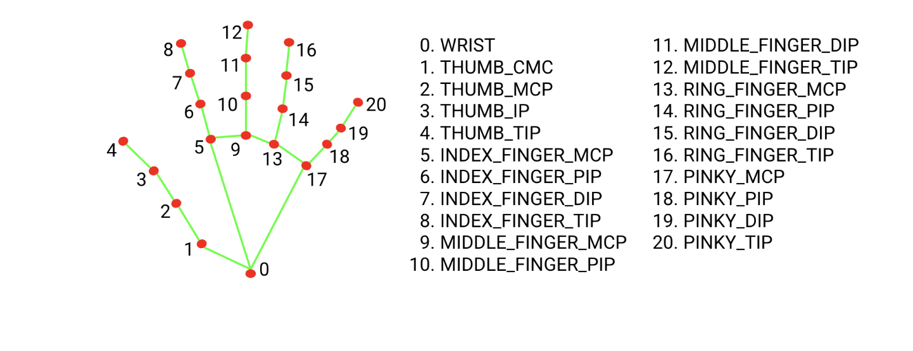

# 👍👆 02. Thumb + Pointer Distance And Rotation Switch

<p style="color:#6ee7b7;"><strong>Goal:</strong> Draw only the thumb tip and pointer finger tip, connect them with a line, calculate left hand distance, and turn the right hand rotation into an on/off switch. The continuous gesture values are still normalized from <code>0</code> to <code>1</code>.</p>

<details open>
<summary><strong>🗺️ Placement Map</strong></summary>

In this part, almost everything goes in `sketch.js`.

Use this map as you work:

1. Global variables go near the top of `sketch.js`, with `canvasWidth` and `canvasHeight`.
2. Function calls like `drawThumbIndexLine(hand)` go inside the hand loop in `draw()`.
3. Helper functions like `drawThumbIndexLine()`, `updateLeftHandDistance()`, and `normalizeValue()` go near the bottom of `sketch.js`, outside of `draw()`.
4. When a later step says to update a helper, go back to that same helper function and add the new lines inside it.

</details>

<details>
<summary><strong>🖐️ <span style="color:#60a5fa;">Step 1: Keypoint Numbers From The Hand Chart</span></strong></summary>

The HandPose model gives each detected hand a `keypoints` array.

The image in on the ml5 website shows that:



- `4` is `THUMB_TIP`
- `8` is `INDEX_FINGER_TIP`

Store those numbers in variables up where we put our canvas width and height:

```js
let canvasWidth = 960;
let canvasHeight = 720;
// new code ⬇️
let thumbTipIndex = 4;
let indexTipIndex = 8;
let fingerTipIndexes = [thumbTipIndex, indexTipIndex];
```

This makes the code easier to read later. Instead of remembering what `4` and `8` mean, we can use names like `thumbTipIndex` and `indexTipIndex`.

</details>

<details>
<summary><strong>🟢 <span style="color:#34d399;">Step 2: Drawing Only Those Points And Lines</span></strong></summary>

In Part 1, we had a loop that drew every keypoint on the hand.

In Part 2, we are changing that. We only want:

1. the thumb tip
2. the pointer finger tip
3. a line between those two points

So inside `draw()`, find the loop that goes through the detected hands:

```js
for (let i = 0; i < hands.length; i++) {
  let hand = hands[i];
}
```

Inside that hand loop, add these two helper function calls:

```js
function draw() {
  background(0);
  image(video, 0, 0, width, height);

  for (let i = 0; i < hands.length; i++) {
    let hand = hands[i];

     // ❌ old code, delete this ⬇️
     for (let j = 0; j < hand.keypoints.length; j++) {
        let keypoint = hand.keypoints[j];
            fill(0, 255, 0);
            noStroke();
            circle(width - keypoint.x, keypoint.y, 12);
      }
     // ❌ old code, delete this ⬆️

    // new code ⬇️
    drawThumbIndexLine(hand);
    drawFingerTipDots(hand);
    // new code ⬆️
  }
}
```

These two lines do not draw everything by themselves. They call helper functions that we will write underneath `draw()`.

Add this helper function after the closing `}` of `draw()`:

```js
// new code ⬇️
function drawThumbIndexLine(hand) {
  let thumbTip = hand.keypoints[thumbTipIndex];
  let indexTip = hand.keypoints[indexTipIndex];

  stroke(0, 255, 0);
  strokeWeight(4);
  line(width - thumbTip.x, thumbTip.y, width - indexTip.x, indexTip.y);
}
// new code ⬆️
```

This helper gets the thumb tip and pointer finger tip:

```js
let thumbTip = hand.keypoints[thumbTipIndex];
let indexTip = hand.keypoints[indexTipIndex];
```

Then it draws a green line between them:

```js
line(width - thumbTip.x, thumbTip.y, width - indexTip.x, indexTip.y);
```

Because the camera is flipped, both x positions use `width - x`.

Under that helper, add one more helper for the two green dots:

```js
// new code ⬇️
function drawFingerTipDots(hand) {
  for (let j = 0; j < fingerTipIndexes.length; j++) {
    let keypointIndex = fingerTipIndexes[j];
    let keypoint = hand.keypoints[keypointIndex];

    fill(0, 255, 0);
    noStroke();
    circle(width - keypoint.x, keypoint.y, 12);
  }
}
// new code ⬆️
```

This helper loops through `fingerTipIndexes`, which only contains `4` and `8`.

That means we draw dots for only the thumb tip and pointer finger tip, instead of every hand keypoint. Notice how this is very similar to the code we just deleted; we basically moved the same logic outside of `draw()` to keep it lean.

<p style="color:#fbbf24;"><strong>💡 Placement note:</strong> The two function calls go inside the hand loop in <code>draw()</code>. The full helper functions go below <code>draw()</code>, outside of it.</p>

</details>

<details>
<summary><strong>🧭 <span style="color:#f472b6;">Step 3: Checking Left Hand And Right Hand</span></strong></summary>

ml5's HandPose results can include a `handedness` property. That tells us if the model thinks the detected hand is `"Left"` or `"Right"`.

Because the webcam is mirrored in this project, the label feels reversed on screen.

So in this sketch:

- our left hand checks for ml5's `"Right"` label
- our right hand checks for ml5's `"Left"` label

Create helper functions.

Put these near the bottom of `sketch.js`, underneath `drawFingerTipDots(hand)`.

```js
function isLeftHand(hand) {
  // The mirrored webcam makes ml5's handedness label feel reversed on screen.
  return hand.handedness.toString().toLowerCase() === "right";
}

function isRightHand(hand) {
  // The mirrored webcam makes ml5's handedness label feel reversed on screen.
  return hand.handedness.toString().toLowerCase() === "left";
}
```

This line:

```js
hand.handedness.toString().toLowerCase()
```

turns the label into lowercase text, so `"Right"`, `"right"`, and `"RIGHT"` all get treated the same way.

Then inside the hand loop in `draw()`, use those helper functions like this:

```js
function draw() {
  background(0);
  image(video, 0, 0, width, height);

  for (let i = 0; i < hands.length; i++) {
    let hand = hands[i];

    drawThumbIndexLine(hand);
    drawFingerTipDots(hand);

    // new code ⬇️
    if (isLeftHand(hand)) {
      updateLeftHandDistance(hand);
    }

    if (isRightHand(hand)) {
      updateRightHandRotation(hand);
    }
    // new code ⬆️
  }
}
```

<p style="color:#fbbf24;"><strong>💡 Important:</strong> These helpers check the model's left/right label, not just the side of the screen. Because the camera is mirrored, the labels are reversed in our sketch.</p>

</details>

<details>
<summary><strong>📏 <span style="color:#facc15;">Step 4: Calculate The Left Hand Distance</span></strong></summary>

First, make the left hand distance variables.

These go near the top of `sketch.js`, with the other global variables:

```js
let thumbTipIndex = 4;
let indexTipIndex = 8;
let fingerTipIndexes = [thumbTipIndex, indexTipIndex];

// new code ⬇️
let minLeftHandDistance = 20;
let maxLeftHandDistance = 220;
let leftHandDistance = null;
let leftHandDistanceNormalized = null;
// new code ⬆️
```

The `minLeftHandDistance` and `maxLeftHandDistance` numbers help turn the raw pixel distance into a nicer `0-1` value.

Now make a helper that normalizes any value.

Put this near the bottom of `sketch.js`, with the other helper functions:

```js
// new code ⬇️
function normalizeValue(value, minValue, maxValue) {
  let normalizedValue = (value - minValue) / (maxValue - minValue);
  return constrain(normalizedValue, 0, 1);
}
// new code ⬆️
```

In Step 3, we already added this call inside the hand loop in `draw()`:

```js
if (isLeftHand(hand)) {
  updateLeftHandDistance(hand);
}
```

Now create the helper that call uses.

Put `updateLeftHandDistance()` near the bottom of `sketch.js`, underneath `isLeftHand()` and `isRightHand()`:

```js
// new code ⬇️
function updateLeftHandDistance(hand) {
  let thumbTip = hand.keypoints[thumbTipIndex];
  let indexTip = hand.keypoints[indexTipIndex];

  leftHandDistance = dist(thumbTip.x, thumbTip.y, indexTip.x, indexTip.y);
  leftHandDistanceNormalized = normalizeValue(
    leftHandDistance,
    minLeftHandDistance,
    maxLeftHandDistance
  );
}
// new code ⬆️
```

The `dist()` function is a p5 function. It finds the distance between two points:

```js
dist(x1, y1, x2, y2);
```

Now:

- `leftHandDistance` is the raw pixel distance
- `leftHandDistanceNormalized` is the `0-1` interaction value

<p style="color:#fbbf24;"><strong>💡 Tuning note:</strong> If the normalized value reaches <code>1</code> too easily, increase <code>maxLeftHandDistance</code>. If it never reaches <code>1</code>, lower <code>maxLeftHandDistance</code>.</p>

</details>

<details>
<summary><strong>🟡 <span style="color:#fde047;">Step 5: Draw The Left Hand Distance Text</span></strong></summary>

Now that the left hand distance is calculated, draw the text next to the left hand line.

Go back to `updateLeftHandDistance()` near the bottom of `sketch.js`.

Add the label code after the normalized distance:

```js
function updateLeftHandDistance(hand) {
  let thumbTip = hand.keypoints[thumbTipIndex];
  let indexTip = hand.keypoints[indexTipIndex];

  leftHandDistance = dist(thumbTip.x, thumbTip.y, indexTip.x, indexTip.y);
  leftHandDistanceNormalized = normalizeValue(
    leftHandDistance,
    minLeftHandDistance,
    maxLeftHandDistance
  );

  // new code ⬇️
  let labelX = width - ((thumbTip.x + indexTip.x) / 2);
  let labelY = (thumbTip.y + indexTip.y) / 2;

  fill(255, 255, 0);
  noStroke();
  textSize(16);
  text("L dist: " + leftHandDistance.toFixed(0), labelX + 16, labelY - 8);
  text("L 0-1: " + leftHandDistanceNormalized.toFixed(2), labelX + 16, labelY + 14);
  // new code ⬆️
}
```

The label position uses the middle point between the thumb and pointer:

```js
let labelX = width - ((thumbTip.x + indexTip.x) / 2);
let labelY = (thumbTip.y + indexTip.y) / 2;
```

The x position uses `width - (...)` because the video is mirrored.

</details>

<details>
<summary><strong>🔄 <span style="color:#38bdf8;">Step 6: Calculate The Right Hand Rotation</span></strong></summary>

Now that the left hand distance and text are working, move to the right hand.

For the right hand, we want a rotation value instead of a distance value.

Make variables to store the right hand rotation.

These go near the top of `sketch.js`, with the other global variables:

```js
let minLeftHandDistance = 20;
let maxLeftHandDistance = 220;
let leftHandDistance = null;
let leftHandDistanceNormalized = null;

// new code ⬇️
let minRightHandRotation = 0;
let maxRightHandRotation = Math.PI / 2;
let rightHandSwitchThreshold = 90;
let rightHandRotation = null;
let rightHandRotationNormalized = null;
let rightHandSwitch = false;
let rightHandWasOverThreshold = false;
// new code ⬆️
```

`Math.PI / 2` means 90 degrees.

In Step 3, we already added this call inside the hand loop in `draw()`:

```js
if (isRightHand(hand)) {
  updateRightHandRotation(hand);
}
```

Now create the helper that call uses.

Put `updateRightHandRotation()` near the bottom of `sketch.js`, underneath `updateLeftHandDistance()`:

```js
// new code ⬇️
function updateRightHandRotation(hand) {
  let thumbTip = hand.keypoints[thumbTipIndex];
  let indexTip = hand.keypoints[indexTipIndex];
  let dx = indexTip.x - thumbTip.x;
  let dy = indexTip.y - thumbTip.y;

  rightHandRotation = atan2(abs(dx), -dy);
  rightHandRotationNormalized = normalizeValue(
    rightHandRotation,
    minRightHandRotation,
    maxRightHandRotation
  );

  let rightHandRotationDegrees = rightHandRotation * 180 / Math.PI;
}
// new code ⬆️
```

This line calculates the angle away from straight up:

```js
rightHandRotation = atan2(abs(dx), -dy);
```

That gives us:

- `0` when the thumb/index line points straight up
- `Math.PI / 2` when the thumb/index line is horizontal, which is 90 degrees
- values over `Math.PI / 2` when the line goes past horizontal

</details>

<details>
<summary><strong>🔘 <span style="color:#22c55e;">Step 7: Turn The Right Hand Rotation Into A Switch</span></strong></summary>

For the right hand, we want a toggle switch:

1. Start with `rightHandSwitch` as `false`.
2. When the rotation crosses the threshold, flip it to `true`.
3. Keep it `true` while the hand stays over the threshold.
4. When the hand goes back below the threshold, the switch is ready to flip again.
5. The next time it crosses the threshold, flip it back to `false`.

Put `updateRightHandSwitch()` near the bottom of `sketch.js`, underneath `updateRightHandRotation()`:

```js
// new code ⬇️
function updateRightHandSwitch(rotationDegrees) {
  let isOverThreshold = rotationDegrees > rightHandSwitchThreshold;

  if (isOverThreshold && rightHandWasOverThreshold === false) {
    rightHandSwitch = !rightHandSwitch;
  }

  rightHandWasOverThreshold = isOverThreshold;
}
// new code ⬆️
```

Then call it inside `updateRightHandRotation()`, right after the degrees line:

```js
function updateRightHandRotation(hand) {
  let thumbTip = hand.keypoints[thumbTipIndex];
  let indexTip = hand.keypoints[indexTipIndex];
  let dx = indexTip.x - thumbTip.x;
  let dy = indexTip.y - thumbTip.y;

  rightHandRotation = atan2(abs(dx), -dy);
  rightHandRotationNormalized = normalizeValue(
    rightHandRotation,
    minRightHandRotation,
    maxRightHandRotation
  );

  let rightHandRotationDegrees = rightHandRotation * 180 / Math.PI;

  // new code ⬇️
  updateRightHandSwitch(rightHandRotationDegrees);
  // new code ⬆️
}
```

This part is the toggle:

```js
rightHandSwitch = !rightHandSwitch;
```

The `!` means "not," so `!false` becomes `true`, and `!true` becomes `false`.

<p style="color:#fbbf24;"><strong>💡 Tuning note:</strong> If going past 90 degrees feels too hard, lower <code>rightHandSwitchThreshold</code> to something like <code>85</code>.</p>

</details>

<details>
<summary><strong>🟦 <span style="color:#38bdf8;">Step 8: Draw The Right Hand Rotation Text</span></strong></summary>

Now draw the right hand values next to the right hand line.

Go back to `updateRightHandRotation()` near the bottom of `sketch.js`.

Add the label code after `updateRightHandSwitch(rightHandRotationDegrees)`:

```js
function updateRightHandRotation(hand) {
  let thumbTip = hand.keypoints[thumbTipIndex];
  let indexTip = hand.keypoints[indexTipIndex];
  let dx = indexTip.x - thumbTip.x;
  let dy = indexTip.y - thumbTip.y;

  rightHandRotation = atan2(abs(dx), -dy);
  rightHandRotationNormalized = normalizeValue(
    rightHandRotation,
    minRightHandRotation,
    maxRightHandRotation
  );

  let rightHandRotationDegrees = rightHandRotation * 180 / Math.PI;
  updateRightHandSwitch(rightHandRotationDegrees);

  // new code ⬇️
  let labelX = width - ((thumbTip.x + indexTip.x) / 2);
  let labelY = (thumbTip.y + indexTip.y) / 2;

  fill(0, 255, 255);
  noStroke();
  textSize(16);
  text("R rot: " + rightHandRotationDegrees.toFixed(0), labelX + 16, labelY - 8);
  text("R 0-1: " + rightHandRotationNormalized.toFixed(2), labelX + 16, labelY + 14);
  text("R switch: " + rightHandSwitch, labelX + 16, labelY + 36);
  // new code ⬆️
}
```

Now the order of the lesson matches the logic:

1. left hand calculation
2. left hand label
3. right hand calculation
4. right hand label

</details>

---

<details>
<summary><strong>✅ <span style="color:#6ee7b7;">Complete <code>sketch.js</code></span></strong></summary>

Your finished `sketch.js` for this step should look like this:

```js
let handPose;
let video;
let hands = [];

let canvasWidth = 960;
let canvasHeight = 720;
let thumbTipIndex = 4;
let indexTipIndex = 8;
let fingerTipIndexes = [thumbTipIndex, indexTipIndex];
let minLeftHandDistance = 20;
let maxLeftHandDistance = 220;
let minRightHandRotation = 0;
let maxRightHandRotation = Math.PI / 2;
let rightHandSwitchThreshold = 90;
let leftHandDistance = null;
let leftHandDistanceNormalized = null;
let rightHandRotation = null;
let rightHandRotationNormalized = null;
let rightHandSwitch = false;
let rightHandWasOverThreshold = false;

function preload() {
  handPose = ml5.handPose();
}

function setup() {
  createCanvas(canvasWidth, canvasHeight);
  video = createCapture(VIDEO, { flipped:true });
  video.size(canvasWidth, canvasHeight);
  video.hide();

  handPose.detectStart(video, gotHands);

  textFont("monospace");
}

function gotHands(results) {
  hands = results;
}

function draw() {
  background(0);
  image(video, 0, 0, width, height);

  leftHandDistance = null;
  leftHandDistanceNormalized = null;
  rightHandRotation = null;
  rightHandRotationNormalized = null;

  for (let i = 0; i < hands.length; i++) {
    let hand = hands[i];

    drawThumbIndexLine(hand);
    drawFingerTipDots(hand);

    if (isLeftHand(hand)) {
      updateLeftHandDistance(hand);
    }

    if (isRightHand(hand)) {
      updateRightHandRotation(hand);
    }
  }
}

function drawThumbIndexLine(hand) {
  let thumbTip = hand.keypoints[thumbTipIndex];
  let indexTip = hand.keypoints[indexTipIndex];

  stroke(0, 255, 0);
  strokeWeight(4);
  line(width - thumbTip.x, thumbTip.y, width - indexTip.x, indexTip.y);
}

function drawFingerTipDots(hand) {
  for (let j = 0; j < fingerTipIndexes.length; j++) {
    let keypointIndex = fingerTipIndexes[j];
    let keypoint = hand.keypoints[keypointIndex];

    fill(0, 255, 0);
    noStroke();
    circle(width - keypoint.x, keypoint.y, 12);
  }
}

function isLeftHand(hand) {
  return hand.handedness.toString().toLowerCase() === "right";
}

function isRightHand(hand) {
  return hand.handedness.toString().toLowerCase() === "left";
}

function updateLeftHandDistance(hand) {
  let thumbTip = hand.keypoints[thumbTipIndex];
  let indexTip = hand.keypoints[indexTipIndex];

  leftHandDistance = dist(thumbTip.x, thumbTip.y, indexTip.x, indexTip.y);
  leftHandDistanceNormalized = normalizeValue(
    leftHandDistance,
    minLeftHandDistance,
    maxLeftHandDistance
  );

  let labelX = width - ((thumbTip.x + indexTip.x) / 2);
  let labelY = (thumbTip.y + indexTip.y) / 2;

  fill(255, 255, 0);
  noStroke();
  textSize(16);
  text("L dist: " + leftHandDistance.toFixed(0), labelX + 16, labelY - 8);
  text("L 0-1: " + leftHandDistanceNormalized.toFixed(2), labelX + 16, labelY + 14);
}

function updateRightHandRotation(hand) {
  let thumbTip = hand.keypoints[thumbTipIndex];
  let indexTip = hand.keypoints[indexTipIndex];
  let dx = indexTip.x - thumbTip.x;
  let dy = indexTip.y - thumbTip.y;

  rightHandRotation = atan2(abs(dx), -dy);
  rightHandRotationNormalized = normalizeValue(
    rightHandRotation,
    minRightHandRotation,
    maxRightHandRotation
  );

  let rightHandRotationDegrees = rightHandRotation * 180 / Math.PI;
  updateRightHandSwitch(rightHandRotationDegrees);

  let labelX = width - ((thumbTip.x + indexTip.x) / 2);
  let labelY = (thumbTip.y + indexTip.y) / 2;

  fill(0, 255, 255);
  noStroke();
  textSize(16);
  text("R rot: " + rightHandRotationDegrees.toFixed(0), labelX + 16, labelY - 8);
  text("R 0-1: " + rightHandRotationNormalized.toFixed(2), labelX + 16, labelY + 14);
  text("R switch: " + rightHandSwitch, labelX + 16, labelY + 36);
}

function updateRightHandSwitch(rotationDegrees) {
  let isOverThreshold = rotationDegrees > rightHandSwitchThreshold;

  if (isOverThreshold && rightHandWasOverThreshold === false) {
    rightHandSwitch = !rightHandSwitch;
  }

  rightHandWasOverThreshold = isOverThreshold;
}

function normalizeValue(value, minValue, maxValue) {
  let normalizedValue = (value - minValue) / (maxValue - minValue);
  return constrain(normalizedValue, 0, 1);
}
```

</details>

<details>
<summary><strong>🧩 <span style="color:#f0abfc;">What The Helper Functions Are Doing</span></strong></summary>

This sketch uses helper functions so each part of the logic has one job:

1. `drawThumbIndexLine(hand)` draws the green line between thumb and pointer.
2. `drawFingerTipDots(hand)` draws only keypoints `4` and `8`.
3. `isLeftHand(hand)` and `isRightHand(hand)` decide which gesture logic to use.
4. `updateLeftHandDistance(hand)` calculates the left hand distance and draws the left hand text.
5. `updateRightHandRotation(hand)` calculates the right hand angle and draws the right hand text.
6. `updateRightHandSwitch(rotationDegrees)` turns the angle into an on/off toggle.
7. `normalizeValue(value, minValue, maxValue)` converts a raw number into a `0-1` value.

<p style="color:#86efac;"><strong>🎯 Result:</strong> The left hand gives you a smooth distance control, and the right hand gives you a switch that flips between <code>true</code> and <code>false</code>.</p>

</details>

<details>
<summary><strong>🔘 <span style="color:#38bdf8;">Why The Right Hand Switch Needs Memory</span></strong></summary>

The switch uses this variable:

```js
let rightHandWasOverThreshold = false;
```

That variable remembers whether the right hand was already past the threshold on the previous frame.

Without that memory, this line would flip the switch many times per second while your hand stayed past 90 degrees:

```js
rightHandSwitch = !rightHandSwitch;
```

The helper prevents that:

```js
if (isOverThreshold && rightHandWasOverThreshold === false) {
  rightHandSwitch = !rightHandSwitch;
}
```

So the switch flips only on the crossing moment:

1. below threshold
2. crosses above threshold
3. switch flips once
4. stays above threshold
5. switch does not keep flipping
6. goes back below threshold
7. ready to flip again

</details>

<details open>
<summary><strong>⚠️ <span style="color:#facc15;">Checkpoint: Test It In The Browser</span></strong></summary>

<p style="color:#facc15;"><strong>⚠️ Before moving on:</strong> Open the project with Go Live and check the browser. When both hands are visible, have someone check the screen with you.</p>

1. The left hand should show `L dist` and `L 0-1`.
2. The right hand should show `R rot`, `R 0-1`, and `R switch`.
3. Both hands should still show green dots and a green line between thumb and pointer.
4. Each new threshold crossing should flip `R switch` between `true` and `false`.

<p style="color:#fbbf24;"><strong>⚠️ Remember:</strong> Because the camera is mirrored, the helper functions intentionally reverse ml5's handedness labels.</p>

</details>
